# GestureSmart 🤲👁️🗣️

An AI-powered mobile accessibility system designed for users with motor and visual impairments, enabling touch-free interaction through gesture recognition, voice commands, and eye-tracking.

## 📱 Overview

GestureSmart bridges the accessibility gap in mobile interfaces by offering an inclusive and adaptive system that enables users to control mobile devices through gestures, voice, or eye movements. This combination of AI technologies ensures usability across diverse environments and offers users the freedom to choose their preferred interaction mode.

## 📸 App Screenshots

Explore the GestureSmart interface and features through our comprehensive screenshot gallery:

<div align="center">

### Main Interface & Navigation
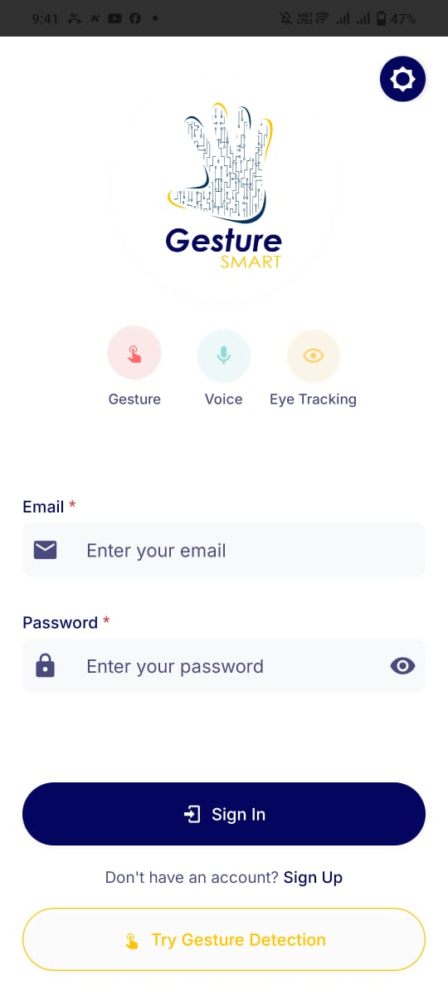 |  | 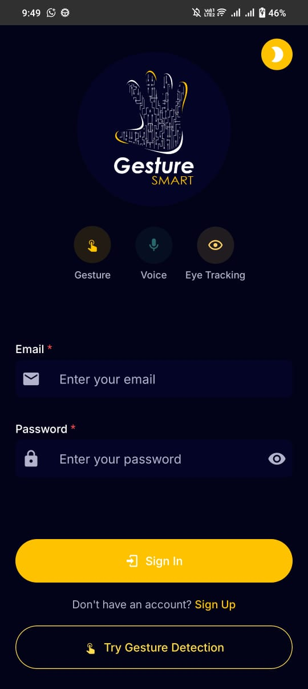 | 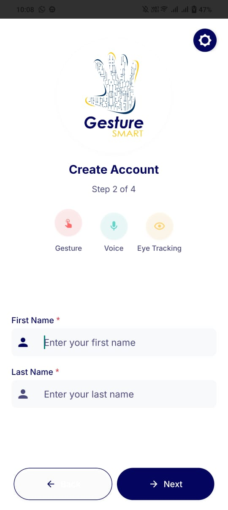
:---:|:---:|:---:|:---:

### Gesture Control Features
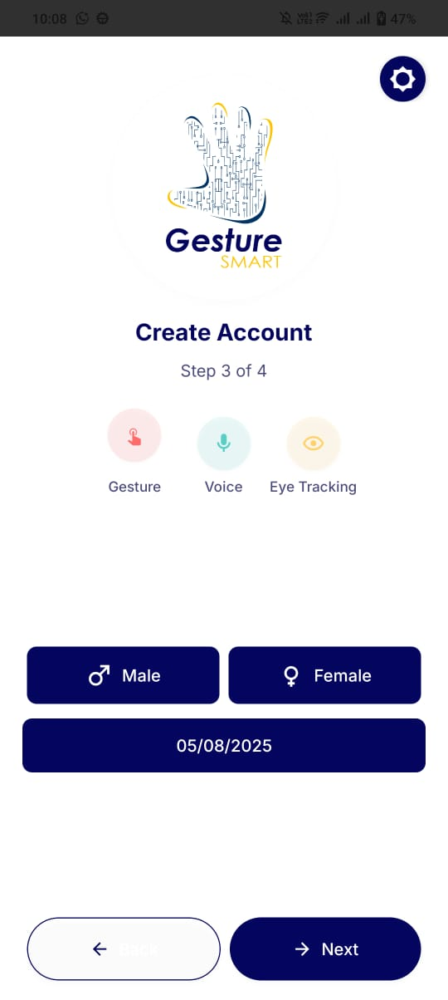 | 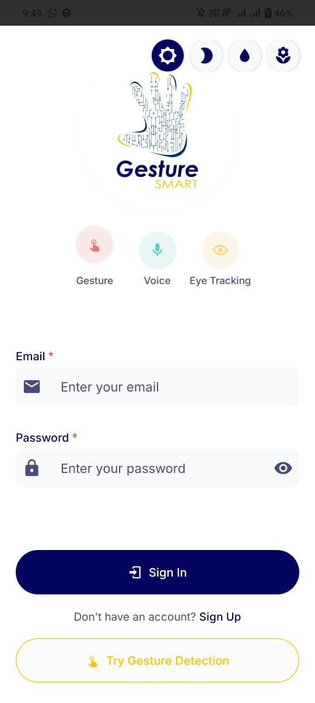 | 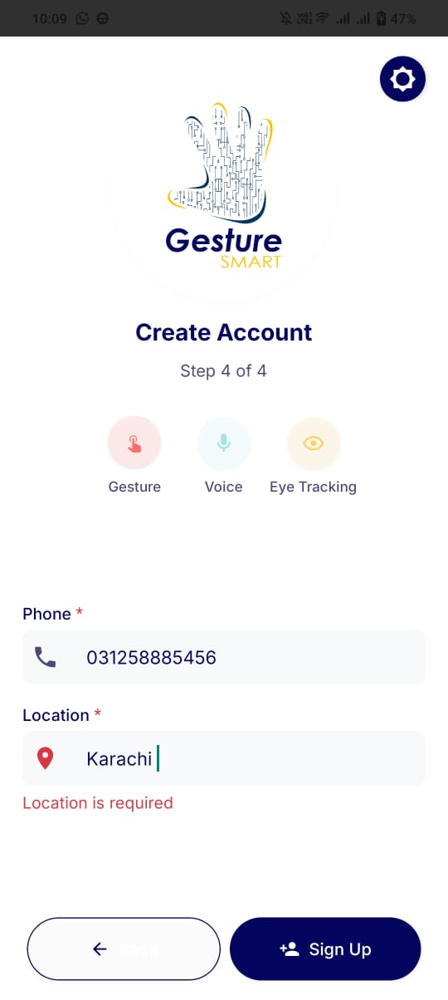 | 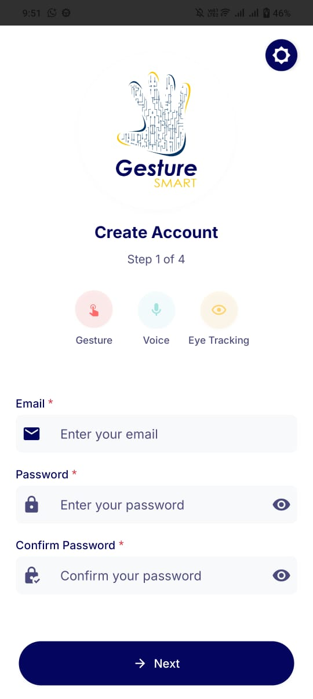
:---:|:---:|:---:|:---:

### Voice Commands & Eye Tracking
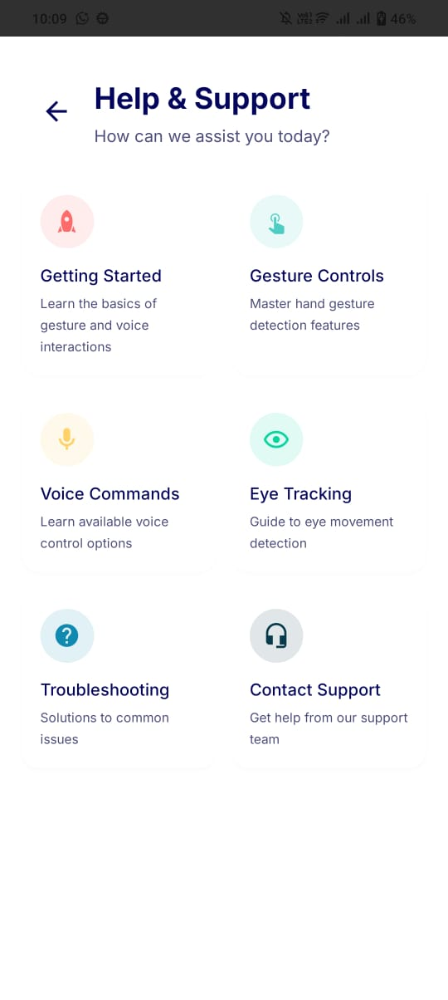 | 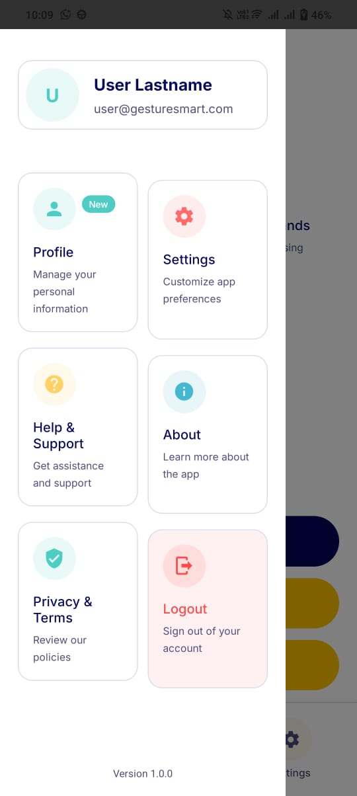 | 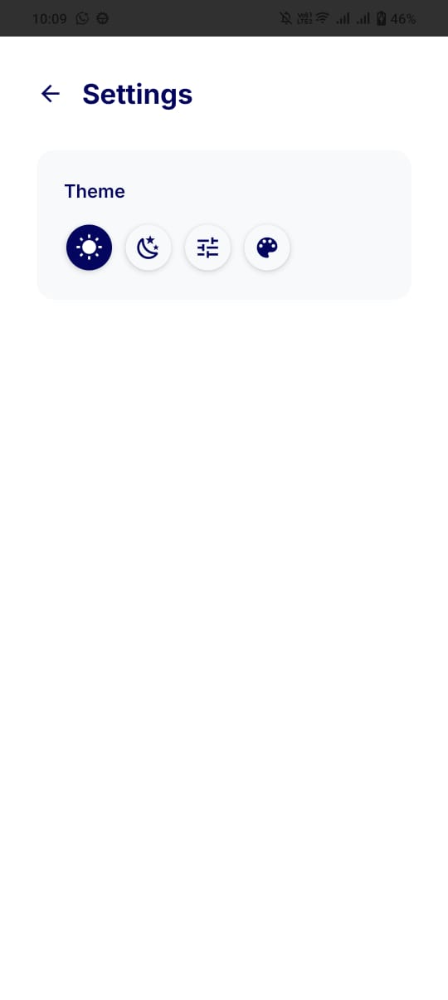 | 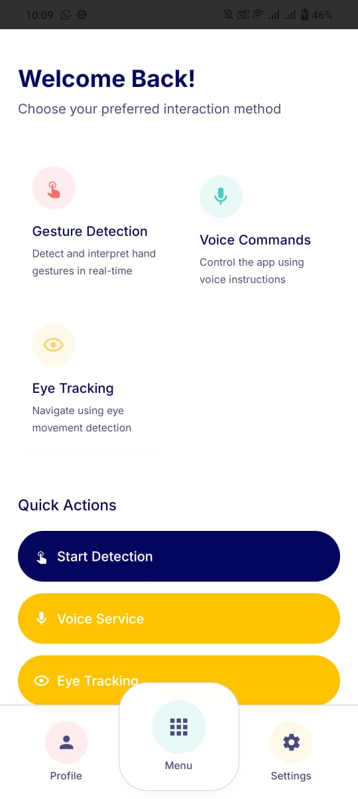
:---:|:---:|:---:|:---:

### Settings & Accessibility Features
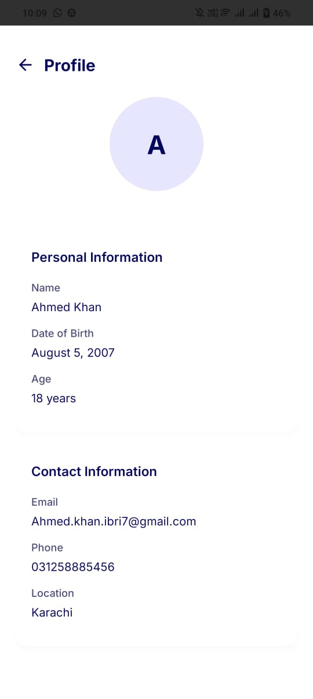 | 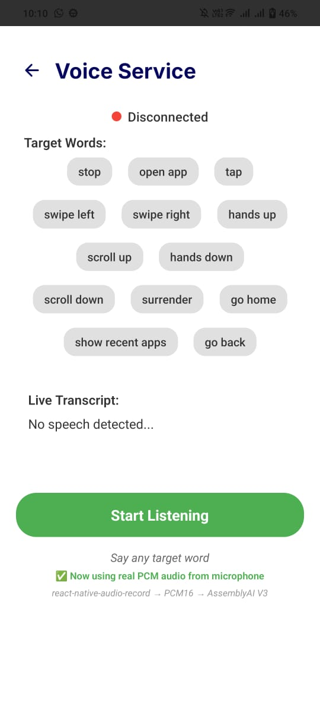 | 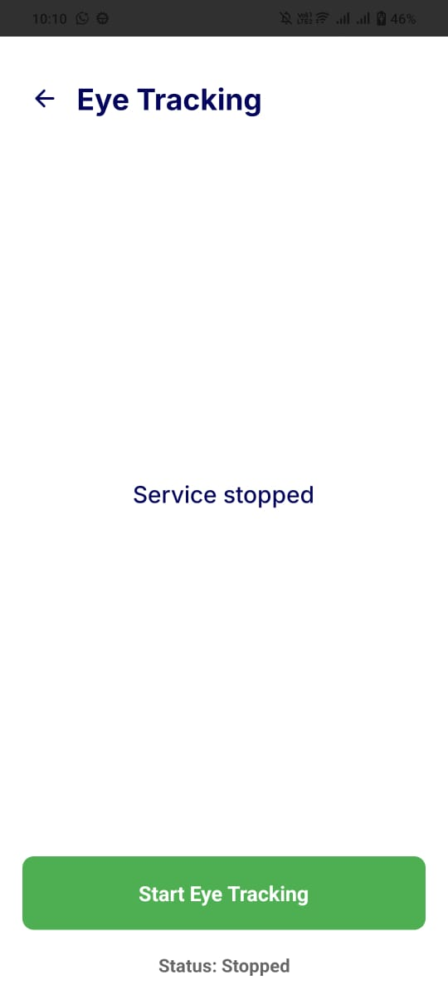 | 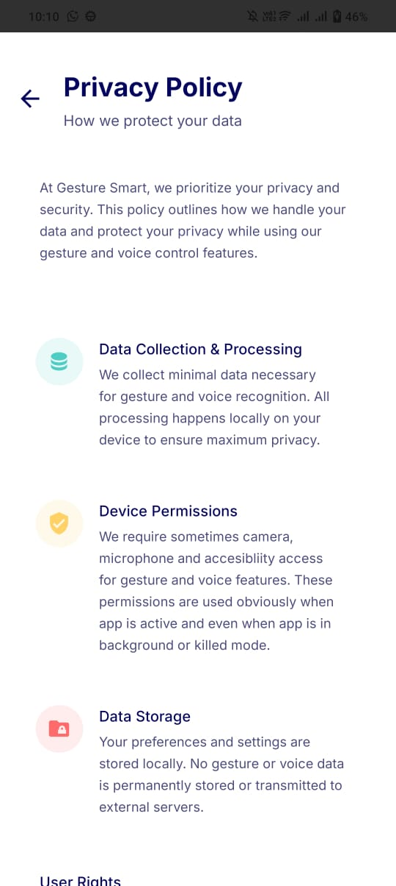
:---:|:---:|:---:|:---:

### Additional Features
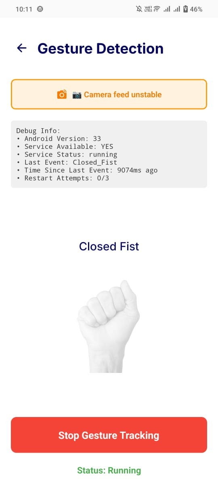 | 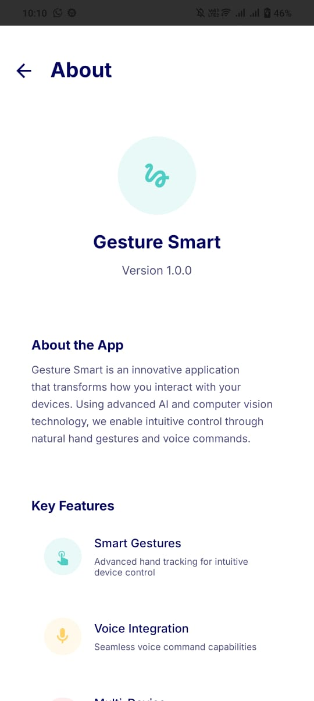 | 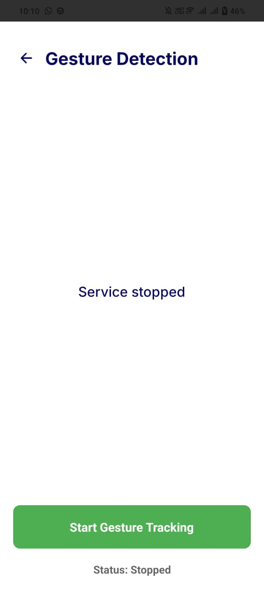 | 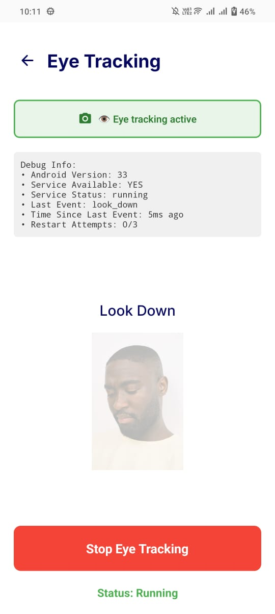
:---:|:---:|:---:|:---:

### User Experience
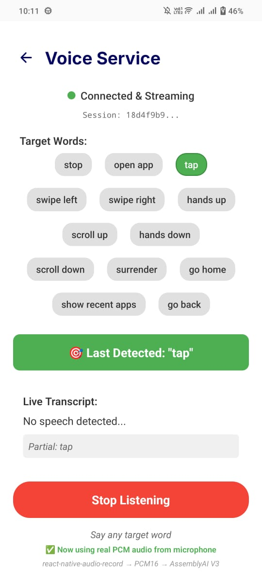
:---:

</div>

## ✨ Key Features

### 🎯 Multi-Modal Control
- **Gesture Control** Hand-based navigation using MediaPipe Gestures and HandPose
- **Voice Commands** Real-time speech input via AssemblyAI API
- **Eye Tracking** MediaPipe FaceMesh-based gaze and blink detection for UI control
- **Seamless Mode Switching** Intelligent fallback mechanisms between input modes

### 🔒 Privacy-Focused Design
- No personal data collection - only anonymized device tokens and session logs
- On-device processing for core gesture features
- Encrypted communication using HTTPS
- WCAG 2.1 compliant accessibility standards

### 📱 Offline Capabilities
- Core gesture features work offline using on-device TensorFlow Lite models
- Ideal for rural or low-connectivity areas
- Ensures privacy and usability without internet dependency

### 🎨 Accessibility-First UI
- Designed following WCAG 2.1 principles for inclusive design
- Voice alerts and audio cues for visual feedback
- Minimal visual clutter to support users with cognitive or visual impairments

## 🏗️ Technology Stack

### Frontend & Mobile
- **Expo SDK 53** - React Native development platform
- **React Native 0.79.5** - Cross-platform mobile framework
- **React 19.0.0** - Latest React version
- **TypeScript 5.8.3** - Type-safe JavaScript development
- **Custom Java Native Code** - Platform-specific optimizations
- **Expo Prebuild** - Custom native code integration

### Backend & Database
- **Node.js** - Server-side runtime
- **MongoDB Atlas** - Cloud database for session data
- **Express.js** - Web application framework
- **Redux Toolkit** - State management
- **Async Storage** - Local data persistence

### AI/ML & Computer Vision
- **MediaPipe Gestures** - Real-time gesture recognition
- **MediaPipe HandPose** - Hand landmark detection
- **MediaPipe FaceMesh** - Eye tracking and facial analysis
- **Google ML Kit Face Detection** - Enhanced face tracking capabilities
- **Custom Java Native Modules** - Optimized ML processing
- **TensorFlow Lite** - On-device machine learning
- **AssemblyAI** - Voice recognition and speech-to-text

## 🤖 AI Models & APIs Documentation

### Hand Gesture Recognition
**MediaPipe Hand Landmarker & Gesture Recognizer**
- **Implementation**: `com.google.mediapipe:tasks-vision:0.10.26.1`
- **Hand Landmarker**: [Google AI Documentation](https://ai.google.dev/edge/mediapipe/solutions/vision/hand_landmarker)
- **Gesture Recognizer**: [Google AI Documentation](https://ai.google.dev/edge/mediapipe/solutions/vision/gesture_recognizer)
- **Model Card**: [Hand Gesture Classification with Fairness](https://storage.googleapis.com/mediapipe-assets/gesture_recognizer/model_card_hand_gesture_classification_with_faireness_2022.pdf)
- **Hand Tracking Model**: [Hand Tracking (Lite/Full) with Fairness](https://storage.googleapis.com/mediapipe-assets/Model%20Card%20Hand%20Tracking%20%28Lite_Full%29%20with%20Fairness%20Oct%202021.pdf)

### Eye Tracking & Face Detection
**Google ML Kit Face Detection**
- **Documentation**: [ML Kit Vision Face Detection](https://developers.google.com/ml-kit/vision/face-detection)
- **Features**: Real-time face mesh analysis, eye gaze tracking, blink detection
- **Privacy**: On-device processing with no data transmission

### Voice Recognition
**AssemblyAI Speech-to-Text**
- **Service**: [AssemblyAI Platform](https://www.assemblyai.com/)
- **Features**: Real-time transcription, noise filtering, multi-language support
- **Usage**: Voice command processing and accessibility features

## ⚙️ Server Configuration

### Environment Variables
```env
PORT=8000
MONGO_URI=your_mongodb_connection_string
TOKEN_KEY=your_jwt_secret_key
APP_NAME=Gesture Smart Server
EmailHost=smtp.gmail.com
EmailPort=587
EmailSecured=false
EmailUser=your_email_address
EmailPass=your_email_password
CLOUD_NAME=your_cloudinary_cloud_name
CLOUDINARY_KEY=your_cloudinary_api_key
CLOUDINARY_SECRET=your_cloudinary_api_secret
ENVIRONMENT=DEV
```

### Required API Keys
1. **MongoDB Atlas** - Database connection
2. **AssemblyAI** - Voice recognition ([Get API Key](https://www.assemblyai.com/))
3. **Cloudinary** - Image/media storage
4. **Email Service** - Notification system

## 📊 Performance Metrics

The system demonstrates high reliability across key performance indicators:

- **Precision** High accuracy in controlled environments
- **Accuracy** Consistent performance across different input modes
- **Recall** Effective detection of user intents
- **TNR (True Negative Rate)** Robust false positive filtering
- **Fallback Reliability** Seamless mode switching preserves usability

## 🚀 Getting Started

### Prerequisites
- Node.js (v18 or higher)
- Expo CLI (latest version)
- Android Studio / Xcode
- EAS CLI (for builds)
- MongoDB Atlas account
- AssemblyAI account
- Java Development Kit (for custom native modules)

### Installation

1. **Clone the repository**
   ```bash
   git clone https://github.com/ateebnoone/gesturesmart.git
   cd MobileApp
   ```

2. **Install dependencies**
   ```bash
   npm install
   # or
   yarn install
   ```

3. **Environment Configuration**
   - Add your API keys in `src/constants/api_keys.ts`
   - Configure server environment variables as shown above

4. **Prebuild with custom native code**
   ```bash
   yarn prebuild
   # This will backup native code, run expo prebuild, and restore custom native modules
   ```

5. **Start the development server**
   ```bash
   yarn start
   # or
   npx expo start
   ```

6. **Run on device/simulator**
   ```bash
   # For Android
   yarn android
   ```

### 🏗️ Building for Production

**Using EAS Build (Recommended)**
```bash
# Build for Android
yarn buildCloud
```

## 🔧 System Architecture

### High-Level Architecture
```
┌─────────────────┐    ┌─────────────────┐    ┌─────────────────┐
│   Expo/RN App   │    │     Node.js     │    │  MongoDB Atlas  │
│  (TypeScript)   │◄──►│     Backend     │◄──►│    Database     │
│  + Custom Java  │    │   (Express.js)  │    │                 │
└─────────────────┘    └─────────────────┘    └─────────────────┘
         │                       │
         ▼                       ▼
┌─────────────────┐    ┌─────────────────┐
│   Native Modules│    │  Cloud Services │
│ • MP Gestures   │    │ • AssemblyAI    │
│ • MP HandPose   │    │ • EAS Build     │
│ • MP FaceMesh   │    │ • Expo Services │
│ • Custom Java   │    │ • Push Notifs   │
└─────────────────┘    └─────────────────┘
```

### Component Architecture
```
┌─────────────────────────────────────────────────────────┐
│                    React Native App                     │
├─────────────────────────────────────────────────────────┤
│  Navigation Layer (React Navigation + Drawer)          │
├─────────────────────────────────────────────────────────┤
│  State Management (Redux Toolkit + Async Storage)      │
├─────────────────────────────────────────────────────────┤
│  Feature Modules                                        │
│  ┌─────────────┐ ┌─────────────┐ ┌─────────────┐      │
│  │   Gesture   │ │    Voice    │ │   Eye Track │      │
│  │  Detection  │ │  Commands   │ │   (FaceMesh)│      │
│  └─────────────┘ └─────────────┘ └─────────────┘      │
├─────────────────────────────────────────────────────────┤
│  Native Bridge (Custom Java + Expo Modules)            │
├─────────────────────────────────────────────────────────┤
│  Platform APIs (Camera, Microphone, Sensors)           │
└─────────────────────────────────────────────────────────┘
```

## 🧠 AI Model Training

### Datasets Used
- **Gesture Recognition** Annotated video frames of hand movements for swipes, taps, and zoom actions using MediaPipe HandPose landmarks
- **Voice Commands** Pre-recorded datasets with varying accents and environmental conditions processed through AssemblyAI
- **Eye Tracking** Facial landmark datasets for gaze direction and blinking pattern detection using MediaPipe FaceMesh

### Model Architecture
- **Preprocessing** Data normalization and augmentation
- **Framework** MediaPipe Gestures, HandPose, and FaceMesh with deep learning integration
- **Training Metrics** Accuracy, Precision, Recall, and F1-Score optimization

## 🏗️ Architecture & Custom Implementation

### Expo Prebuild Integration
GestureSmart utilizes Expo's managed workflow with custom native code integration:

- **Expo SDK 53** Latest managed workflow benefits
- **Custom Java Modules** Performance-critical ML processing
- **Automated Build Scripts** Backup/restore native code during prebuild
- **EAS Build** Cloud-based compilation for production builds

### Native Code Integration
```bash
# Custom scripts for native code management
yarn backup-native    # Backup custom native modules
yarn restore-native   # Restore after prebuild
yarn prebuild        # Full prebuild with native code preservation
```

### State Management Architecture
- **Redux Toolkit** Centralized state management
- **Async Storage** Persistent local data storage
- **React Navigation** Multi-screen navigation with drawer
- **Background Actions** Continuous gesture recognition

## 🎯 Use Cases

### Primary Users
- Individuals with motor impairments
- Visually impaired users
- Users with speech difficulties
- Elderly users seeking simplified interfaces

### Environments
- **Noisy Environments** Voice recognition with noise filtering
- **Low-Light Conditions** Gesture and eye-tracking alternatives
- **Dynamic Settings** Adaptive mode switching based on context
- **Offline Scenarios** Core functionality without internet dependency

## 🔮 Future Enhancements

### 🎨 Custom Gesture Learning
- Enable users to create personalized hand gestures
- On-device ML training for privacy and adaptability
- Tailored gestures based on individual mobility needs

### 📱 Braille via Haptic Feedback
- Vibration-based tactile cues to simulate Braille
- Navigate interface without visual or audio support
- Enhanced accessibility for blind users

### ⚡ On-Device ML Optimization
- Lightweight, personalized models
- Improved accuracy and responsiveness
- Reduced cloud dependency for better privacy

### 🌍 Multilingual & NLP Support
- Regional language support (Urdu, Hindi, Pashto, etc.)
- Right-to-left (RTL) text support
- Localized content for global accessibility

## 🧪 Testing & Validation

The system underwent extensive testing across:
- **Controlled Environments** Laboratory conditions with optimal lighting and minimal noise
- **Real-World Scenarios** Varied lighting, background noise, and user movement
- **Accessibility Compliance** WCAG 2.1 guidelines adherence
- **Cross-Platform Compatibility** iOS and Android device testing

## 🤝 Contributing

We welcome contributions to make GestureSmart more accessible and inclusive! Please read our [Contributing Guidelines](CONTRIBUTING.md) before submitting pull requests.

### Development Guidelines
1. Follow Expo and React Native best practices
2. Ensure accessibility compliance in all features
3. Test custom native modules on multiple devices
4. Use TypeScript for type safety
5. Maintain clean Redux state architecture
6. Document native code integrations
7. Test prebuild process before major releases

## 📄 License

This project is licensed under the MIT License - see the [LICENSE](LICENSE) file for details.

## 📞 Contact & Support

**Developer: Atib Ur Rehman**

- 📧 Email: [ateebnoone@gmail.com](mailto:ateebnoone@gmail.com)
- 💬 WhatsApp: [+923182553930](https://wa.me/+923182553930)

## 🙏 Acknowledgments

Special thanks to all the testers and accessibility advocates who provided valuable feedback during development and testing phases. Your insights were crucial in making GestureSmart truly inclusive.

## 📈 Project Status

GestureSmart is actively maintained and continuously improved. The system has demonstrated technical and commercial viability as a scalable accessibility solution through extensive real-world testing.

---

*Building technology that empowers everyone to interact with the digital world, regardless of their physical abilities.*
